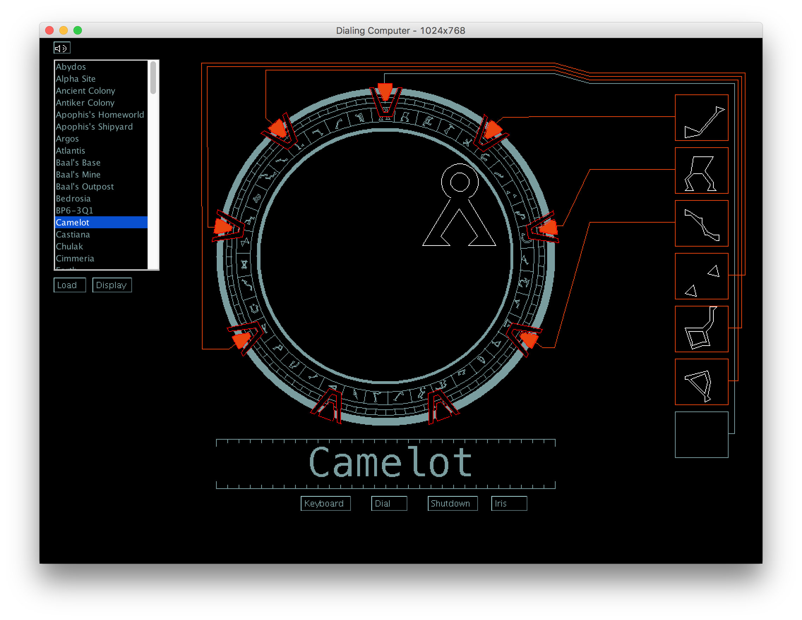

# Stargate Dialing Computer

Emulates the dialing computer from Stargate SG-1.

## Instructions
There are several basic capabilities built into this dialing computer. To dial the gate, you must first input an address. To dial automatically, select an address from the list on the left side of the screen, click "Load", and then click "Dial." To dial manually, click "Dial" and then select symbols from the keyboard. Clicking "Shutdown" at any point during an automatic or manual dialing process will turn off the Stargate. Finally, clicking on the Iris button opens and closes the iris. This doesn't have any effect other than looking and sounding cool.

## Extra Tricks
* CTRL+Z Toggles programming mode. When programming mode is enabled, other features are available:
  * CTRL+D Toggles debugging info within "programming mode" (currently hidden behind list...)
  * CTRL+7 Sets the computer to dial seven symbols. This is the required setting for most addresses.
  * CTRL+8 Sets the computer to dial eight symbols. This is the required setting for addresses in other galaxies (Atlantis, Othala)
  * CTRL+9 Sets the computer to dial nine symbols. This setting is currently unused.
  * If an unknown address is input, several dialog boxes open to ask for the name of the address and the destination planet. Java code for this address is then saved to "Addresses.txt" in the same directory as the Jar file. (This is how I add addresses to the hard-coded database without looking up the numbers).
